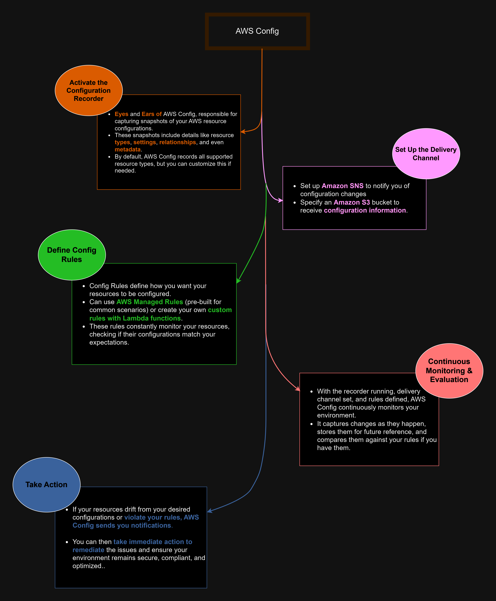
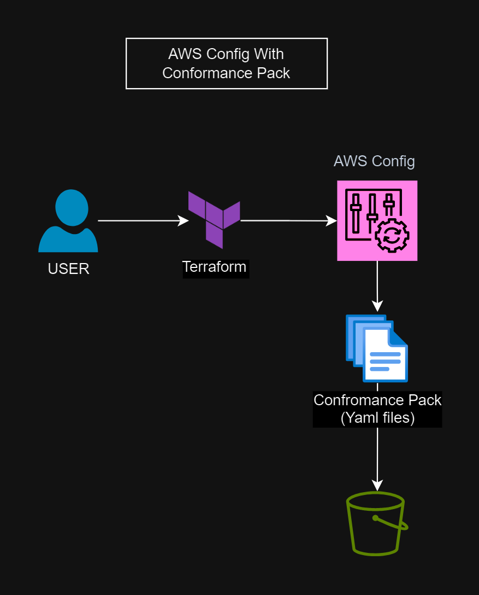
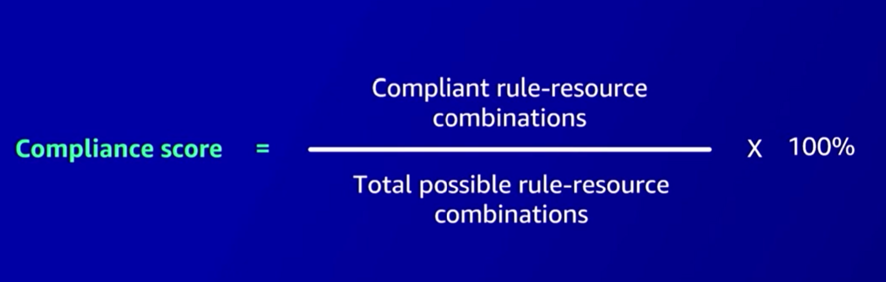

Markdown
# AWS CONFIG WITH CONFORMANCE PACK

[](config.png)

# AWS Config: Your AWS Environment's X-Ray Vision

AWS Config is your all-in-one solution for gaining complete visibility and control over your AWS infrastructure. It provides a detailed inventory of your resources, tracks configuration changes, and helps you ensure compliance and security.


## Core Features

1. **Configuration Recorder:**
   - Automatically captures and records the configuration details of your AWS resources at regular intervals.
   - Provides a snapshot of your resources' current state, allowing you to track changes over time.

2. **Delivery Channel:**
   - Delivers configuration snapshots and change notifications to an Amazon S3 bucket for storage and analysis.
   - Optionally, sends notifications to an Amazon SNS topic to alert you of configuration changes in real time.

3. **Config Rules (Optional):**
   - Define the desired configuration settings for your AWS resources.
   - Use AWS Managed Rules for common use cases or create custom rules with Lambda functions for specific requirements.
   - Config Rules constantly monitor your resources and evaluate their compliance with the defined criteria.

## Why AWS Config is Essential

* **Security & Compliance:** Detect unauthorized changes and ensure your environment adheres to industry standards and regulations.
* **Operational Excellence:**  Gain insights into your infrastructure's configuration history, simplifying troubleshooting and root cause analysis.
* **Cost Optimization:** Identify unused or underutilized resources, leading to potential cost savings.
* **Change Management:** Understand the impact of changes before they are implemented, reducing the risk of unexpected disruptions. 


## The Missing Piece: Enter Conformance Packs

While AWS Config gives you incredible visibility into your AWS environment, it doesn't automatically enforce compliance with your desired standards. That's where Conformance Packs come in.

### Why AWS Config Alone Wasn't Enough

* **Manual Rule Management:** Creating and managing individual Config Rules for every compliance requirement was time-consuming and prone to errors.
* **Inconsistent Enforcement:** Ensuring consistent rule enforcement across multiple AWS accounts and regions required manual effort.
* **Lack of Pre-Built Standards:** You had to develop and maintain your own custom rules to align with industry standards like PCI DSS or HIPAA.
* **No Automated Remediation:** Non-compliant resources triggered notifications, but fixing them required manual intervention.
* **Scaling Challenges:** As your AWS environment grew, managing individual Config Rules became increasingly complex.

### How Conformance Packs Elevate Your Compliance

* **Pre-Defined Rule Sets:** Conformance Packs bundle multiple Config Rules into a single package, making it easy to deploy and enforce entire compliance standards with a few clicks.
* **Automated Compliance Checks:** Conformance Packs continuously evaluate your resources against the defined rules, ensuring ongoing adherence to your chosen standards.
* **Consistent Enforcement:** Easily deploy Conformance Packs across multiple AWS accounts and regions, ensuring consistent compliance throughout your organization.
* **Immutable Rules:** Once deployed, Conformance Packs are immutable, preventing unauthorized changes to your compliance standards.
* **Automated Remediation:**  You can configure Conformance Packs to automatically remediate non-compliant resources, saving you time and effort.


# aws config terraform overiew.drawio.png

[](terraform-highlvl.png)

[](score.png)
Conformance Packs fill the gaps in AWS Config by providing:
By combining AWS Config with Conformance Packs, you gain a complete solution for monitoring, enforcing, and maintaining compliance in your AWS infrastructure.


# AWS Config Conformance & Recorder Terraform Project

[](https://www.terraform.io/)
[](https://aws.amazon.com/)

This Terraform project streamlines the process of setting up AWS Config, a powerful service that helps you monitor, audit, and enforce compliance across your AWS resources. Specifically, this project focuses on S3 bucket security.

## Dark Yellow Theme 🎨

 _(Image Placeholder for Dark Yellow Theme)_

## Project Structure

## Key Components & How They Work Together

1. **AWS Config Recorder:**
   * Continuously records the configuration changes of your AWS resources (in this project, we focus on S3 buckets).
   * This creates a historical record of how your infrastructure has evolved over time.

2. **Conformance Packs:**
   * Define a set of desired configurations (compliance rules) for your resources.
   * In this project, a conformance pack checks if your S3 buckets are publicly accessible (which is a security risk). You can customize the rules by modifying the templates in the `Conformance_templates` folder.
   * AWS Config compares your actual resource configurations against these rules, and reports any non-compliance.

3. **IAM Roles and Policies:**
   * Provide the necessary permissions for the AWS Config service to operate.
   * The project carefully defines these permissions to ensure least privilege security.

4. **S3 Buckets:**
   * Two S3 buckets are created:
      * One for storing the AWS Config configuration history (where the recorder puts its data).
      * Another for storing the Conformance Pack template file.
   * Versioning is enabled on these buckets to protect against accidental data loss or changes.

## Customization

### Variables (variables.tf)

| Variable                    | Description                                                                         | Default Value                    |
| -------------------------- | ----------------------------------------------------------------------------------- | --------------------------------- |
| `region`                   | The AWS region to deploy resources.                                                  | "us-east-1"                       |
| `configRecorder_role_name`  | Name of the IAM role for AWS Config.                                                 | "config_role"                     |
| `configRecorder_policy_name` | Name of the IAM policy for AWS Config.                                                | "config_policy"                   |
| `RecorderBucketName`        | Name of the S3 bucket where Config stores its data.                                  | "karam7790123"                     |
| `configRecorder_name`       | Name of the AWS Config recorder.                                                      | "config_recorder"                 |
| `ConformancePack1_bucketName` | Name of the S3 bucket where conformance pack templates are stored.                | "karam7790conformance"           |
| `ConformanceName`           | Name of the conformance pack.                                                        | "conformancepack"                 |

* Modify these variables in the `variables.tf` file to fit your environment and naming conventions.

## How to Use (Step-by-Step)

1. **Prerequisites:**
   * An AWS account
   * Terraform installed on your machine
   * AWS CLI installed and configured

2. **Clone Repository:**

   ```bash
   git clone https://github.com/KaramHussain/AWS-Config-Conformance-Pack
   cd AWS-Config-Conformance-Pack

2. **Customize:** 
   * Open variables.tf and adjust the values according to your needs.
   * (Optional) Modify conformance pack templates in Conformance_templates/ if you want to add more rules.

3. **Initialize Terraform:**
   * terraform init 

4. **Initialize Terraform:**
   * terraform apply